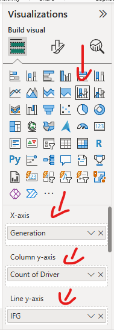
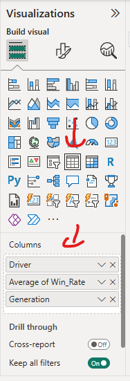
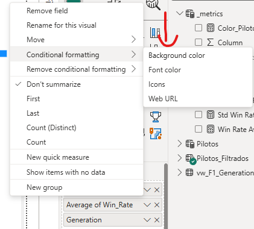
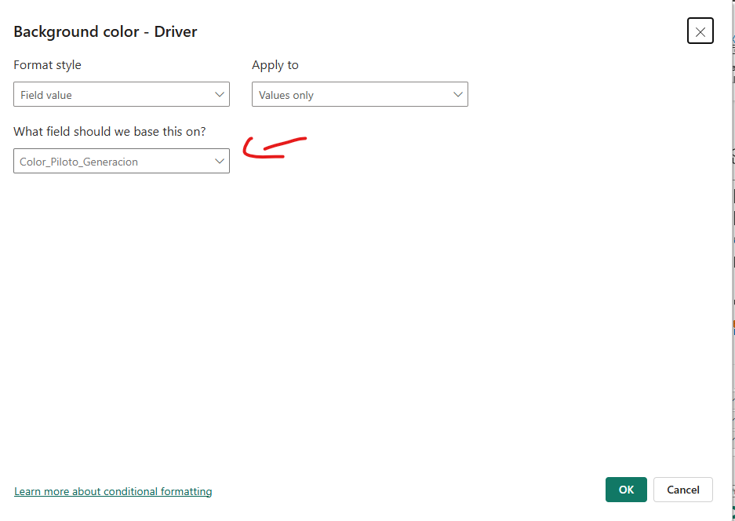
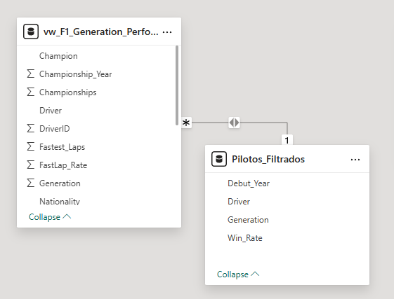
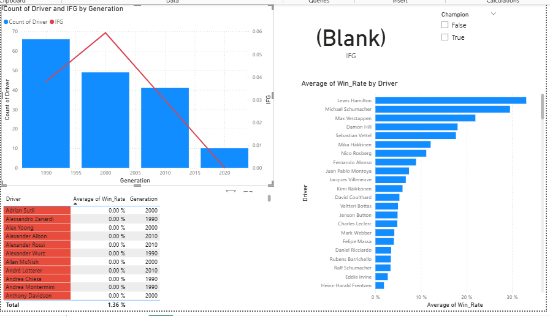

# F1 Generations Analysis

**Executive Summary**

Project to evaluate the historical performance of Formula 1 drivers by *generations* (1990s, 2000s, 2010s, 2020s) using a complete data analytics workflow: ingestion and normalization in **SQL Server**, exploratory and statistical analysis in **Python**, and final visualization in **Power BI**.
The objective is to build a reproducible deliverable that demonstrates technical mastery and analytical judgment. This project can provide insight into the response to the original problem and clearly conclude which generation is the strongest.

---

## Table of Contents

1. [Objectives](#objectives)
2. [Dataset & Sources](#dataset--sources)
3. [Data Model (SQL)](#sql-data-model)
4. [SQL Pipeline Overview (ETL)](#sql-etl-pipeline-overview)
5. [Analysis in Python (Step Summary)](#python-analysis-steps-summary)
6. [Power BI — Visualization and Storytelling](#power-bi--visualization-and-storytelling)
7. [Suggested File Structure](#suggested-file-structure)
8. [How to Reproduce / Prerequisites](#how-to-reproduce--prerequisites)
9. [Key Results (summary)](#key-results-summary)
10. [Lessons Learned](#lessons-learned)
11. [Contact and License](#contact-and-license)

---

## Objectives

* Build a complete workflow (SQL → Python → Power BI) that serves as a demonstration case for data engineering and analysis.
* Compare pilot generations to identify which was the **strongest**, justifying the result with statistical and graphical metrics.
* Document each technical and analytical decision to ensure reproducibility.

---

## Dataset & Sources

* **Source**: CSV with records per driver (columns: `Driver`, `Nationality`, `Seasons`, `Championship_Years`, `Championships`, `Race_Wins`, `Fastest_Laps`, `Win_Rate`, etc.). Available on Kaggle: https://www.kaggle.com/datasets/petalme/f1-drivers-dataset/data
* **Initial State**: The `Seasons` and `Championship_Years` columns came as grouped text lists. They were normalized at the row level in the SQL phase for better data manipulation based on project requirements.
* The original file is kept in `/data` for traceability and replication of the analysis.

---

## Data Model (SQL)

Tables created:

* `F1Drivers_Dataset` — *staging* table (raw copy of the CSV).
* `Drivers` — clean table, with corrected types.
* `Driver_Seasons` — one row per driver-season.
* `Driver_Championships` — one row per driver-championship.

**Reasoning**: The separation between *staging* and *clean* tables facilitates debugging, versioning, and direct connection from Python or Power BI.

---

## SQL Pipeline Summary (ETL)

1. **Ingest:** Import the CSV into `F1Drivers_Dataset`.
2. **Initial validations:** Null and duplicate detection, metric consistency (`Race_Wins <= Race_Starts`).
3. **Creation of `DriverID`** and primary keys.
4. **Normalization** of `Seasons` and `Championship_Years` using `STRING_SPLIT` or `OPENJSON`.
5. **Views** of `vw_F1_Generation_Performance` analysis for consumption in Python and Power BI.

Scripts available in `/sql`.

---

## Analysis in Python (step summary)

Notebook: `/python/F1Analysis.ipynb`

### Extraction and Preparation
* Connecting to SQL Server using `pyodbc`.
* Additional cleaning (types, residual normalization, filtering out incomplete generations).

### Generational Metrics Calculation
For each generation:
* `mean_winrate`, `std_winrate`, `count_pilots`
* **GFI (Generational Strength Index):**
```python
metrics_df["GFI"] = metrics_df["mean_winrate"] * np. log1p(metrics_df["count_pilots"])
```

* **Coefficient of Variation (CV):**
```python
metrics_df["CV"] = np. where(
metrics_df["mean_winrate"] != 0,
metrics_df["std_winrate"] / metrics_df["mean_winrate"],
np. nan
)
```
---
## Argumentative Visualization for Analysis Conclusion

* Chart Combined: bars from `count_pilots` + line from `IFG`.
* Libraries used: `pandas`, `numpy`, `matplotlib`, `seaborn`.

---

## Power BI — Visualization and Storytelling

**Goal:** To replicate and expand the interpretation of Python analysis using interactive dashboards that allow for the flexibility of curiosity.

### Metrics defined in DAX
```DAX
Mean Win Rate = AVERAGE('Filtered_Pilots'[Win_Rate])
Count Pilots = DISTINCTCOUNT('Pilots'[Driver])

IFG =
VAR currentGen = 
SELECTEDVALUE('Filtered_Pilots'[Generation])
VAR meanRate = 
CALCULATE( 
[Mean Win Rate], 
'Filtered_Pilots'[Generation] = currentGen 
)
VAR nPilots = 
CALCULATE ( 
[Count Pilots], 
'Filtered_Pilots'[Generation] = currentGen 
)
RETURN
meanRate * LOG(1 + nPilots)

Pilot_Color_Generation =
VAR pilotWR =
AVERAGE('Filtered_Pilots'[Win_Rate])
VAR avgGen =
CALCULATE(
AVERAGE('Filtered_Pilots'[Win_Rate]),
ALLEXCEPT('Filtered_Pilots', 'Filtered_Pilots'[Generation])

)
VAR stdGen =
CALCULATE(
STDEV.P('Leaked_Pilots'[Win_Rate]),
ALLEXCEPT('Leaked_Pilots', 'Leaked_Pilots'[Generation])
)
RETURN
IF(
avgGen = 0 || ISBLANK(avgGen) || stdGen = 0,
"#808080", -- gray: no data or no wins (like the 2020 generation)
SWITCH(
TRUE(),
pilotWR >= avgGen + stdGen, "#2ECC71", -- green: exceptional
pilotWR < avgGen, "#E74C3C", -- red: below average
"#F1C40F" -- yellow: average
)
)
```

- **Main chart:** `Line and stacked column chart`
- **X-axis:** `'Filtered_Pilots'[Generation]`
- **Y-axis:** `'Filtered_Pilots'[Driver]`
- **Y-axis line:** `'Filtered_Pilots'[Driver]`
- **Measurement table:** `_metrics` (table disconnected to control the calculation context).
- **Visual result:** IFG behavior aligned with Python, with slight numerical differences attributable to rounding or the internal implementation of the `LOG()` function in DAX.

---

## Dashboard features

- **Main chart:** combination of columns (pilot count) and line (IFG).
- **Detail table:** includes `Driver`, `Win_Rate`, `Generation` with conditional formatting to highlight outstanding pilots.
- **Color rule:** Green for drivers whose performance is clearly above the generation average, red for those below; cases with IFG = 0 (no wins) are omitted from the highlighting to avoid false positives.

**Final file:** `/powerbi/F1Visuals.pbix`

---

## File Structure

```bash
F1 Project/
├─ image.png
├─ image-1.png
├─ image-2.png
├─ image-3.png
├─ image-4.png
├─ image-5.png
├─ README-EN.md
├─ README-SP.md
├─ data/
│ └─ F1Drivers_Dataset.csv
├─ sql/
│ └─ normalizationEN.sql
│ └─ normalizationSP.sql  
│ └─ ViewCreationEN.sql
│ └─ ViewCreationSP.sql  
├─ python/
│ └─ F1 AnalysisEN.ipynb
│ └─ F1 AnalysisSP.ipynb  
├─ powerbi/
│ └─ F1Visuals.pbix
```

---

## How to Reproduce / Prerequisites

### 1. Environment Requirements

- **SQL Server** (2019 or higher) with support for `STRING_SPLIT()` and `OPENJSON()`.
- **Python 3.9+** with the following libraries:
```bash
pandas
numpy
matplotlib
sqlalchemy
pyodbc
seaborn
```
- **Power BI Desktop** (current version or higher as of June 2024).

---

## 2. Loading and Normalizing Data in SQL Server

**Create the database** and run the scripts in `/sql/` in this order:
- `normalization.sql` → creates the normalized base tables.
- `views.sql` → defines the intermediate and analysis views.
---

## 3. Analysis in Python

Open the `/python/F1 Analysis.ipynb` file and run each cell in order.

### SQL Server Connection
```python
import pyodbc

conn = pyodbc.connect(
'DRIVER={ODBC Driver 17 for SQL Server};'
'SERVER=localhost;'
'DATABASE=F1 Drivers;'
'Trusted_Connection=yes;'
)

query = "SELECT * FROM dbo.vw_F1_Generation_Performance;"
df = pd.read_sql(query, conn)
```

## Metric Calculation

### Generational Strength Index (GSI)

The **Generational Strength Index (GSI)** is defined as a composite measure that seeks to capture both the average performance of drivers in a generation and the depth of the group (evaluating the group divided by generation).
In Python, it was calculated with the following formula:

```python
metricas_df["IFG"] = metricas_df["mean_winrate"] * np.log1p(metricas_df["count_pilots"])
```

In Power BI, the equivalent implementation in DAX is:

```DAX
IFG =
VAR meanRate = CALCULATE([Mean Win Rate], ALLEXCEPT('Pilotos', 'Pilotos'[Generation]))
VAR nPilots = CALCULATE([Count Pilots], ALLEXCEPT('Pilotos', 'Pilotos'[Generation]))
RETURN
meanRate * LOG(1 + nPilots)
```
> 💡 **Note:** Although the values ​​are not identical between Python and Power BI, the general behavior of IFG remains consistent.
> Slight differences are attributed to internal rounding and the specific implementation of `LOG()` in DAX versus `np.log1p()` in Python.

---

### Coefficient of Variation (CV)

The **Coefficient of Variation (CV)** is used to assess **consistency** within each generation,
indicating the level of relative dispersion in driver performance.
It is defined as the ratio of the standard deviation to the mean of the `Win_Rate`:

```python
metrics_df["CV"] = np.where(
metrics_df["mean_winrate"] != 0,
metrics_df["std_winrate"] / metrics_df["mean_winrate"],
np.nan
)

- **High CV →** greater variability between drivers (less consistency).
- **Low CV →** more uniform performance within the generation.
```
---

## Power BI Integration

Load the data from SQL Server and load the **vw_F1_Generation_Performance_view.**

- Create the **Pilots_table:**
```DAX
Pilots_Filtered =
SUMMARIZE(
'vw_F1_Generation_Performance',
'vw_F1_Generation_Performance'[Driver],
"Debut_Year", MIN('vw_F1_Generation_Performance'[Season]),
"Win_Rate", MAX('vw_F1_Generation_Performance'[Win_Rate])
)
```
- Create the **Pilots_Filtered_table:**
```DAX
Pilots_Filtered =
FILTER(
'Pilots',
NOT ISBLANK('Pilots'[Generation])
)
```
### Using main chart (Line and stacked column chart) and table visual
- **X-axis:** `'Filtered_Pilots'[Generation]`
- **Measurement table:** `_metrics` (table disconnected to control calculation context).
- **Visual result:** IFG behavior aligns with Python's,
with minor differences attributable to rounding or the logarithmic function in DAX.

### **Line and stacked column chart configuration**


### **Line and stacked column chart configuration**


### To classify drivers by color, apply their respective metric to the background color of the Driver column:




### For proper filtering, it is necessary to create a bidirectional one-to-many relationship between `vw_F1_Generation_Performance` and `Filtered_Drivers` using the `Driver` column.



---

### Dashboard Features

- **Main chart:** Combination of columns (driver count) and line (IFG).
- **Detail table:** Includes `Driver`, `Win_Rate`, `Generation` with conditional formatting to highlight outstanding drivers.
- **Color rule:**
- 🟩 Green → IFG above the generation average.
- 🟥 Red → IFG below the average.
- No color → IFG equal to 0.

**Final file:** `/powerbi/F1Visuals.pbix`

---

## Visual structure



> 💡 **Note:** Aside from the main tables, the rest are interactive add-ons for further exploration if desired, which are included in the `F1Visuals.pbix` file.

---

## Key results (summary)

| Generation | Mean Win Rate | Count Pilots | IFG | CV |
|-------------|-------------:|--------:|------:|
| 1990 | 0.0129 | 66 | 0.0379 | 3.52 |
| 2000 | 0.0202 | 49 | 0.0595 | 2.82 |
| 2010 | 0.0101 | 41 | 0.0297 | 3.52 |
| 2020 | 0.0000 | 10 | 0.0000 | — |

---

## Conclusions

- **Generation 2000:** presents the **highest IFG**, reflecting a balance between number and quality of pilots.
- **Generation 1990:** stands out for its volume of pilots, although with a lower average effectiveness.
- **Generation of 2010:** shows wide dispersion in performance, without clear dominant figures.
- **Generation of 2020:** does not yet offer sufficient data for a representative analysis.

---

### Generational Strength Ranking

| 🏁 Ranking | Generation | Interpretation |
|------------|-------------|------------|
| 🥇 **1** | **2000** | Greater generational strength — ideal balance between quantity and performance |
| 🥈 **2** | **1990** | Broad participation, less consistency |
| ⚠️ **3** | **2010** | Irregular and variable performance |
| 🚧 **4** | **2020** | Developing generation, limited data |

---

### General Analysis

The **Generational Strength Index (GSI)** proves to be a stable and representative metric for comparing aggregate driver performance across decades.
Although small numerical differences arise between Python and Power BI—due to variations in logarithm handling and internal rounding—**the general trend is maintained**, validating the consistency of the entire pipeline.

It is concluded that:

- The **1990s–2000s** represent the most competitive period in modern Formula 1.
- The **decline observed since 2010** could be explained by the dominance of a few drivers and the reduction in the total number of outstanding competitors.
- The **2020 generation**, still under development, requires more seasons for a robust evaluation.

> Overall, the **SQL → Python → Power BI** flow allowed us to objectively quantify and visualize the evolution of competitiveness by generation, showing a reproducible example of analytical integration of historical data in business or research environments.

---

## Lessons Learned

This project demonstrated a complete analytical chain, combining:
- **SQL Server** to structure and normalize the data.
- **Python (Pandas, NumPy, SciPy)** for statistical exploration and generation of advanced indicators such as the GFI and the coefficient of variation.
- **Power BI** to create a **visual storytelling** that clearly communicates conclusions.

The process demonstrated how **differences between calculation engines (NumPy vs. DAX)** can slightly alter absolute values, but without compromising analytical validity or the interpretation of trends.

---

## General Conclusion

The combined analysis of **depth (number of competitive drivers)** and **quality (average Win Rate)** allowed for the construction of a synthetic index, the **GFI (Generational Strength Index)**, which summarizes global competitiveness for each decade.
Using the SQL → Python → Power BI pipeline, a **Reproducible, documented, and scalable, ideal for data analysis portfolios or academic projects.

> In summary, the 2000 generation has established itself as the strongest according to the IFG, followed by the 1990 generation, while more recent generations show a decline attributable to the concentration of victories among a few drivers.

---

## Contact

Author: Arturo Carreras

> [ LinkedIn: www.linkedin.com/in/arturo-carreras-18549a1b4 / [GitHub](https://github.com/Arturo-777) / Email: arturoc211995@gmail.com ]

---

*This README summarizes the complete technical and analytical process of the Formula 1 generational analysis project, integrating SQL, Python, and Power BI under a professional and reproducible approach.*
